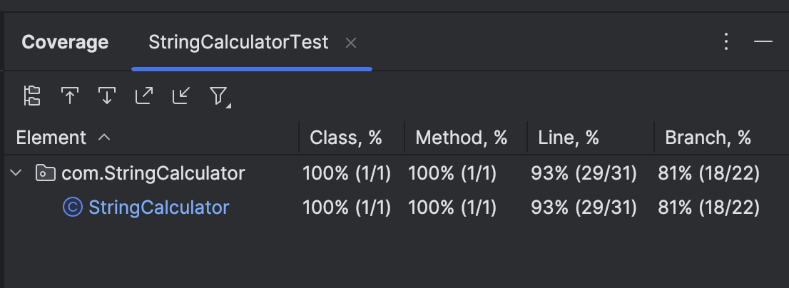

# Incubyte-TDD-Assessment

## 🧪 Project Overview

This project is a **Test-Driven Development (TDD)** based implementation of the **String Calculator Kata**, inspired by the guidelines from Roy Osherove. It was built as part of the **Incubyte Software Craftsperson TDD Assessment**.

The String Calculator is a utility that takes a string input of numbers separated by delimiters and returns their sum. The calculator was developed following **TDD principles** and covers all required functionalities in incremental steps with proper unit tests.

---

## 🎯 Problem Statement

Create a simple String calculator with a method signature:

```java
int Add(string numbers);
```

The method can take up to two numbers, separated by commas, and will return their sum. For example `""` or `"1"` or `"1,2"` as inputs. For an empty string it will return 0.

---

## ✅ Three Rules of TDD

1. **Write only enough code to make a failing test compile.**
2. **Write only enough test to fail (compilation failures count as failures).**
3. **Write only enough production code to make the failing test pass.**

---

## 🔨 Technologies Used

- **Language**: Java 17+
- **Testing Framework**: JUnit 5
- **Build Tool**: Maven
- **IDE**: IntelliJ IDEA 

---


## 🧪 Features Implemented

| Feature | Description | Status |
|--------|-------------|--------|
| **Empty String** | Returns 0 | ✅ |
| **Single Number** | `"1"` returns 1 | ✅ |
| **Two Numbers** | `"1,2"` returns 3 | ✅ |
| **Multiple Numbers** | `"1,2,3,4,5"` returns 15 | ✅ |
| **Newline Delimiter** | `"1\n2,3"` returns 6 | ✅ |
| **Custom Delimiter** | `"//;\n1;2"` returns 3 | ✅ |
| **Negative Numbers Exception** | `"1,-2"` throws exception with message | ✅ |
| **Multiple Negatives Exception** | `"1,-2,-3"` shows all negatives in exception | ✅ |
| **Ignore Numbers > 1000** | `"2,1001"` returns 2 | ✅ |
| **Variable Length Delimiters** | `"//[***]\n1***2***3"` returns 6 | ✅ |
| **Multiple Delimiters** | `"//[*][%]\n1*2%3"` returns 6 | ✅ |
| **Multiple Long Delimiters** | `"//[***][%%%]\n1***2%%%3"` returns 6 | ✅ |
| **Trailing Delimiter Validation** | `"1,2,3,"` throws `NumberFormatException` | ✅ |

---

## ✅ Test Cases and Expected Outputs

| Input | Output | Description |
|-------|--------|-------------|
| `""` | 0 | Empty string |
| `"1"` | 1 | Single number |
| `"1,2"` | 3 | Two numbers |
| `"1,2,3"` | 6 | Multiple numbers |
| `"1\n2,3"` | 6 | Mixed delimiters |
| `"//;\n1;2"` | 3 | Custom delimiter |
| `"//[***]\n1***2***3"` | 6 | Variable length delimiter |
| `"//[*][%]\n1*2%3"` | 6 | Multiple delimiters |
| `"2,1001"` | 2 | Ignore numbers > 1000 |
| `"1,-4"` | Exception: `Negatives are Not allowed: -4` | Negative numbers |
| `"1,-2,-3"` | Exception: `Negatives are Not allowed: -2, -3` | Multiple negatives |
| `"1,2,3,"` | `NumberFormatException` | Trailing delimiter |

---
## Test Coverage📷
   


## 🧪 Sample Tests in JUnit 5

```java
@Test
public void testEmptyStringReturnsZero() {
    assertEquals(0, calc.add(""));
}

@Test
public void testSingleNumberReturnsNumber() {
    assertEquals(1, calc.add("1"));
    assertEquals(5, calc.add("5"));
}

@Test
public void testTwoNumbersReturnSum() {
    assertEquals(3, calc.add("1,2"));
    assertEquals(10, calc.add("4,6"));
}

```

---

## 📁 Project Structure

```
src/
├── main/
│   └── java/
│       └── com/
│           └── StringCalculator/
│               └── StringCalculator.java
└── test/
    └── java/
        └── com/
            └── StringCalculator/
                └── StringCalculatorTest.java
```

---

## 🚀 How to Run

### Prerequisites
- Java 17 or higher installed
- Maven installed
- IDE with Java support (IntelliJ IDEA, Eclipse, VS Code)

### Running Tests
```bash
# Run all tests
mvn test

# Run tests with verbose output
mvn test -Dtest=StringCalculatorTest

# Run specific test method
mvn test -Dtest=StringCalculatorTest#testEmptyStringReturnsZero
```

### Building the Project
```bash
# Compile the project
mvn compile

# Package the project
mvn package

# Clean and compile
mvn clean compile
```

---

## 📊 TDD Development Process

1. **Red**: Write a failing test
2. **Green**: Write minimal code to make the test pass
3. **Refactor**: Improve code quality while keeping tests green
4. **Repeat**: Continue with the next requirement


---

## 🎯 Key Learning Outcomes

- **Test-Driven Development** principles and practices
- **Incremental development** approach
- **Exception handling** with custom messages
- **String parsing** and manipulation
- **Regular expressions** for delimiter handling
- **Code refactoring** techniques
- **Unit testing** with JUnit 5

---

## 🔗 References

- [Roy Osherove's String Calculator Kata](http://osherove.com/tdd-kata-1/)
- [JUnit 5 Documentation](https://junit.org/junit5/docs/current/user-guide/)
- [Maven Documentation](https://maven.apache.org/guides/)

